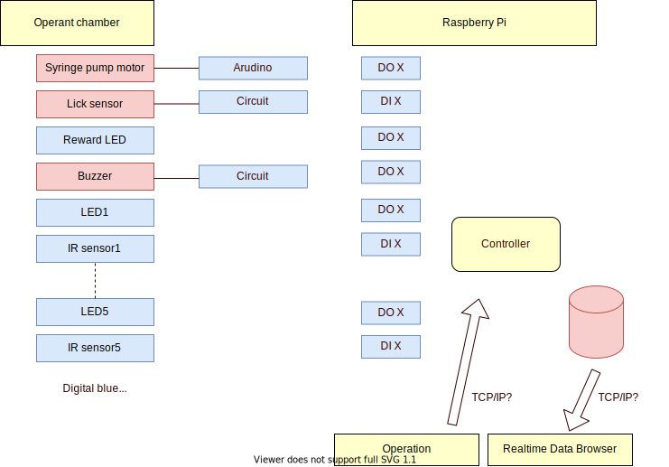
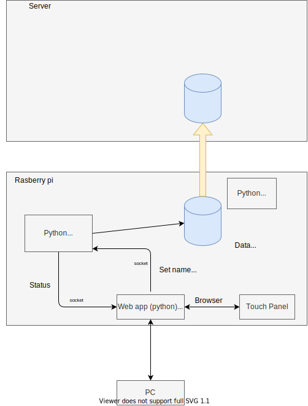

# 目的
Raspberry PiとArduinoを組み合わせてstandaloneで行動実験系を制御する

* [Rusberry Pi spec](./docs/rasberrypi.md)
# Overview

# 3CSRTT
### パラメータに関する説明：
 m : Nose Poke物理ポート番号を指定し、それぞれのNose Poke Wait [m] Stateを定義し、トータル５つのNose Poke Wait [m]のStateが平行して動作している。  
 x : Nose Pokeの正解ポート番号を指定する。設定ファイルを設け、それぞれのTrialに対して、xを指定し、正解ポートを定義する。  
 m : マウスが実際にNose Pokeしたセンサーの番号を出力する。  

注：xパラメータを指定する設定ファイルが各Trialに対してTrial Entryをユーザーが設定する仕様。TrialがEntryの最後に到達した後、最初のEntryに戻り、ユーザーが停止するまで、Trialが繰り返される仕様
  

| Phase    | is_nosepoke_skip | is_lickwait | is_perservative | waittime_in_s | timeout_in_s | limited_hold_in_s | stimulus duration_in_s |
|----------|------------------|-------------|-----------------|----------|---------|--------------|-------------------|
| Phase1   | True             | False       | False           | 20       | 0       | 0            | 0                 |
| Phase2   | False            | False       | False           | 0        | 0       | 0            | ∞                 |
| Phase3   | False            | True        | False           | 0        | 0       | 0            | ∞                 |
| Phase4   | False            | True        | False           | 0        | 0       | 0            | ∞                 |
| Phase5-1 | False            | True        | True            | 5        | 5       | 5            | 30  |
| Phase5-2 | False            | True        | True            | 5        | 5       | 5            | 15  |
| Phase5-3 | False            | True        | True            | 5        | 5       | 5            | 10  |
| Phase5-4 | False            | True        | True            | 5        | 5       | 5            | 7  |
| Phase5-5 | False            | True        | True            | 5        | 5       | 5            | 5  |
| Phase5-6 | False            | True        | True            | 5        | 5       | 5            | 3  |
| Phase6 | False            | True        | True            | 5        | 5       | 5            | 1  |

| trial | x     |
|-------|-------|
| 1     | 3&4&5 |
| 2     | 3&4&5 |
| 3     | 3&4&5 |
| 4     | 3&4&5 |
| 5     | 4     |
| 6     | 3     |

## 結果を評価し、phaseの移行を制御する方法の検討
### Phase1
現在のトライアルからXトライアル前の結果を集計し、Cue　onsetからY秒以内にリックしたtrialの割合がZ％を越えたらPhase2 へ移行
### Phase2
現在時刻から1時間前までの結果を集計し、ノーズポーク数が15回を超えたらphase3へ移行
### Phase3
現在時刻から1時間前までの結果を集計し、ノーズポーク数が15回を超えたらphase4へ移行
### Phase4
現在時刻から1時間前までの結果を集計し、下記AorBを満たしたらphase5へ移行
* 基準A: accuracy>50% かつ correct responses >15
* 基準B: correct responses > 30
### Phase5/6
成績に関わらず規定トライアル数で移行？

# Communication

