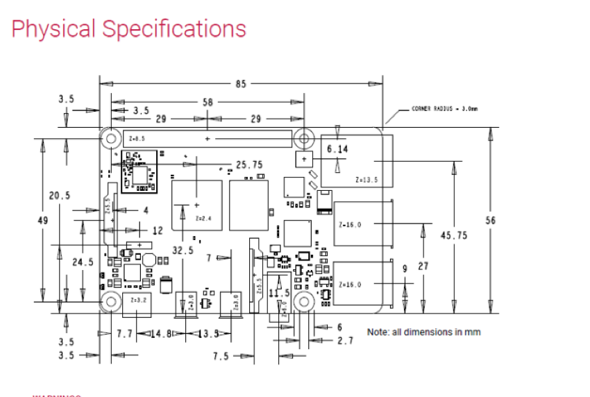
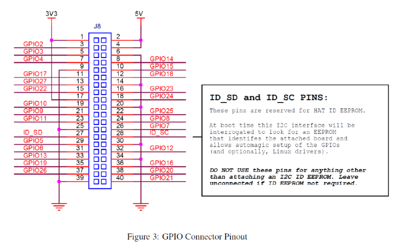
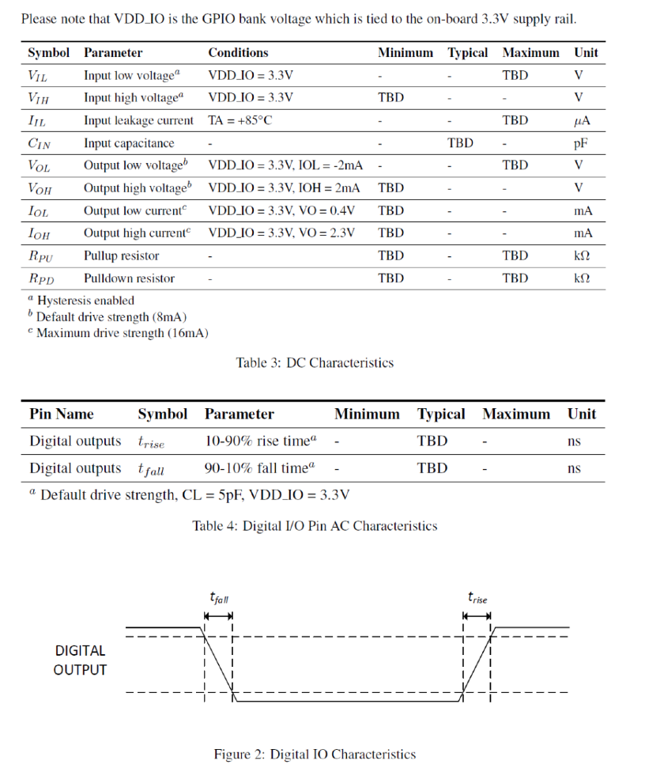
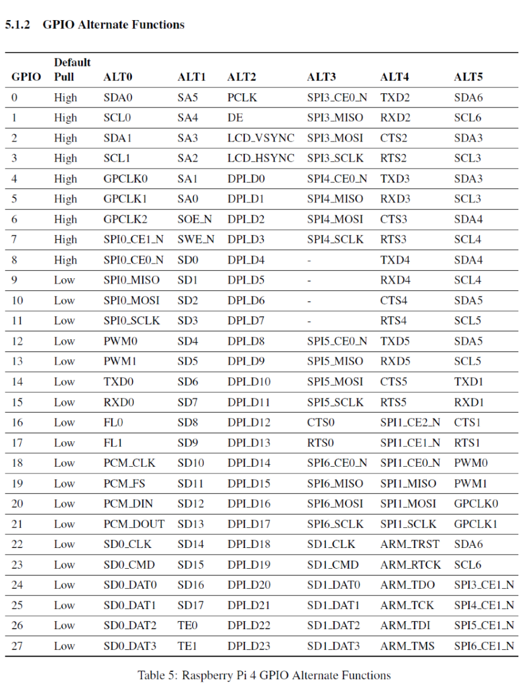

# Raspberry Pi 4 Model B board 
https://www.raspberrypi.org/products/raspberry-pi-4-model-b/

## Spec
* Processor: Broadcom BCM2711, quad-core Cortex-A72 (ARM v8)
64-bit SoC @ 1.5GHz
* Memory: 　8GB LPDDR4
(Depending on model) with on-die ECC
* Connectivity:
    * 2.4 GHz and 5.0 GHz IEEE 802.11b/g/n/ac wireless
    * LAN, Bluetooth 5.0, BLE
    * Gigabit Ethernet
    * 2 × USB 3.0 ports
    * 2 × USB 2.0 ports.
* GPIO: Standard 40-pin GPIO header
* (fully backwards-compatible with previous boards)
* Video & sound: 2 × micro HDMI ports (up to 4Kp60 supported)
* 2-lane MIPI DSI display port
* 2-lane MIPI CSI camera port
* 4-pole stereo audio and composite video port
* Multimedia: H.265 (4Kp60 decode);
    * H.264 (1080p60 decode, 1080p30 encode);
    * OpenGL ES, 3.0 graphics
* SD card support: Micro SD card slot for loading operating system and data storage
* Input power: 5V DC via USB-C connector (minimum 3A1)
    * 5V DC via GPIO header (minimum 3A1)
    * Power over Ethernet (PoE)–enabled
    * (requires separate PoE HAT)
* Environment: Operating temperature 0–50ºC

## Hardware related Interface 

### Related HW Documentation
https://www.raspberrypi.org/documentation/computers/raspberry-pi.html
https://datasheets.raspberrypi.org/rpi4/raspberry-pi-4-datasheet.pdf

### HW IOインタフェース仕様（IO電圧 3.3V）：
汎用IO(GPIO)はRaspberry Piの40ピンのピンヘッダーに接続されており、使用可能だが、
GPIOは他の機能にもマッピングされて使用されているので、主に、下記の15本の汎用IOピンが使用可能

* GPIO５
* GPIO６
* GPIO１２
* GPIO１３
* GPIO１６
* GPIO１７（Gen0）
* GPIO１８（Gen1）
* GPIO１９
* GPIO２０
* GPIO２１
* GPIO２２（Gen3）
* GPIO２３（Gen4）
* GPIO２４（Gen5）
* GPIO２５（Gen6）
* GPIO２６
### 汎用IOのAC/DC特性

### 汎用IOの各ピンのDefaultのPull State

# 利用時の仕様
##
* OS: TODO
* Python: 3.8 ?
* Web server: TODO

## 汎用IOの使用配置（暫定） 
* 入力信号：7本
* 出力信号：8本
* GND 信号: 1本
* VIO信号: 1本

* GPIO５		 	(Output) Nose Poke LED0
* GPIO６ 		(Output) Nose Poke LED1
* GPIO１２ 		(Output) Nose Poke LED2
* GPIO１３ 		(Output) Nose Poke LED3
* GPIO１６ 		(Output) Nose Poke LED4
* GPIO１７（Gen0） 	(Output) Home Lamp
* GPIO１８（Gen1） 	(Output) Lick LED 
* GPIO２４（Gen5） 	(Output) Syringe Pump Trigger 
* GPIO１９ 		(Input) Nose Poke Sensor 0
* GPIO２０ 		(Input) Nose Poke Sensor 1
* GPIO２１ 		(Input) Nose Poke Sensor 2
* GPIO２２（Gen3） 	(Input) Nose Poke Sensor 3
* GPIO２３（Gen4） 	(Input) Nose Poke Sensor 4
* GPIO２５（Gen6） 	(Input) Lick Sensor 
* GPIO２６             	(Input) Food Sensor

